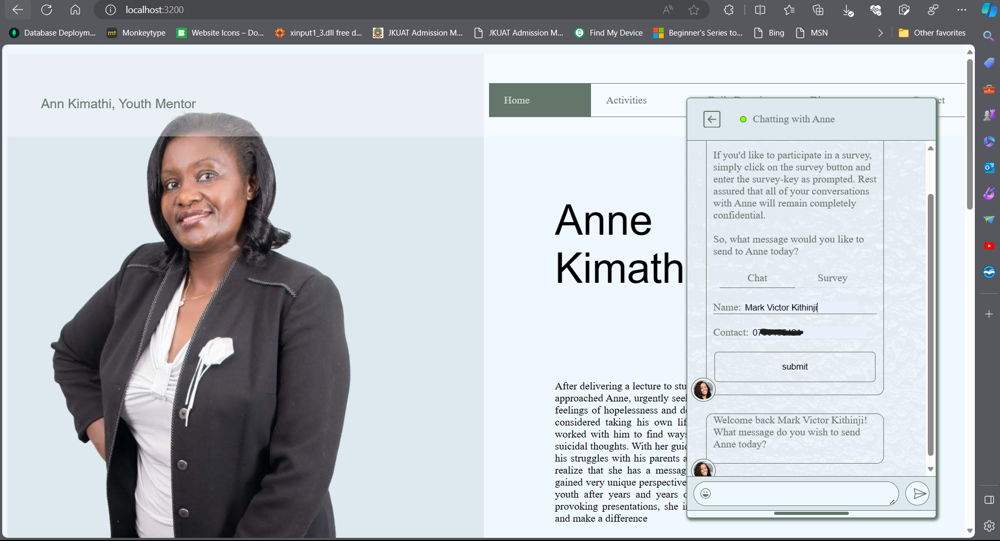

# Anne Kimathi Personal Website

## Youth mentor and public speaker

## images

1) Homepage with the chatbot are open. The chatbot allows users to directly talk to Anne with no need for exchanging contacts!
To avoid malice though, the user must first sign in the chatbot.

2) The upcoming carousel has a clever preview to avoid banner blindness. The preview is interactable.

3) The contacts section is meant to be relaxing to encourage free expression. It is meant to make the ender feel comfortable.

4) The review section is meant to be engaging and interactible, unlike many others. A slider randomly selects one of the commentors and their review is shown.

Production in final stages. Patching UI errors and improving security.
